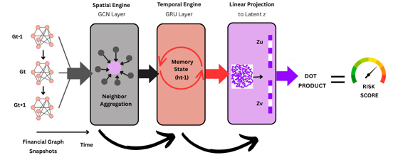

# Self-Supervised ST-GNN for Financial Contagion Detection

##  Overview
This repository contains the official PyTorch implementation for the project:  
**"Self-Supervised Learning For Early Warning And Contagion Detection in Financial Networks Using GNNs"**.

### Problem Statement
Global financial markets are tightly interconnected, meaning small, localized distress can rapidly escalate into systemic contagion (e.g., 2008 Crisis, SVB Collapse). Traditional static risk models often fail to capture the **temporal velocity** of capital flight.

### Our Solution
We propose a **Spatiotemporal Graph Neural Network (ST-GNN)** that models the global banking system as a dynamic, evolving graph.
* **Spatial Engine:** Graph Convolutional Networks (GCN) capture cross-border dependencies.
* **Temporal Engine:** Gated Recurrent Units (GRU) learn historical volatility and risk evolution.
* **Self-Supervised Learning:** Uses a novel "Liquidity Shock" labeling strategy to detect crises without manual annotation.

---

## Architecture

*Fig 1. The proposed ST-GNN pipeline combining GCN and GRU layers.*

The model takes a sequence of financial graph snapshots ($G_{t-1}, G_t, G_{t+1}$) and projects a latent risk score for every country-to-country link.

---

## Dataset
This project uses **Locational Banking Statistics (LBS)** from the [Bank for International Settlements (BIS)](https://www.bis.org/statistics/bankstats.htm).

* **Time Period:** 1977 – 2023 (Quarterly)
* **Nodes:** Countries (Reporting and Counterparty)
* **Edges:** Cross-border financial claims (USD Millions)

